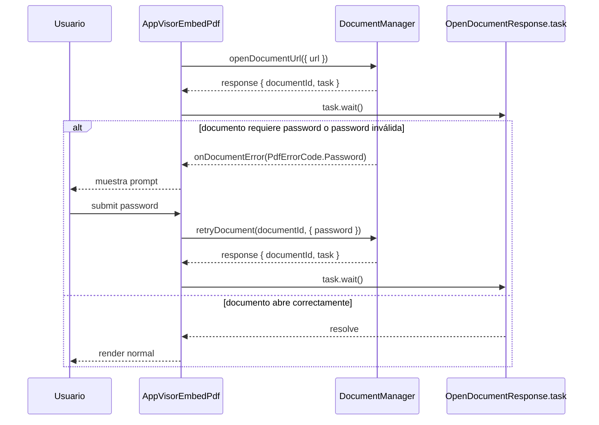

# SCRUMCORE-209 — Arquitectura Técnica

## Archivos impactados
- `src/app/Components/UI/AppVisorEmbedPdf/AppVisorEmbedPdf.tsx`
- `src/app/Components/UI/AppVisorEmbedPdf/presentation/AppPdfPasswordPrompt.tsx`
- `src/app/Components/UI/AppVisorEmbedPdf/presentation/AppPdfPasswordPrompt.module.css`
- `src/app/Components/UI/AppVisorEmbedPdf/hooks/useDemoPdfUrl.ts`
- `src/app/Components/UI/AppVisorEmbedPdf/AppVisorEmbedPdf.test.tsx`

## Arquitectura (alto nivel)
```mermaid
flowchart TD
  A[Pdfium Engine] --> B[EmbedPDF Host]
  B --> C[DocumentManager Plugin]
  C --> D[openDocumentUrl / retryDocument]
  C --> E[onDocumentError (PdfErrorCode.Password)]
  D --> F[OpenDocumentResponse.task.wait()]
  F --> G[Viewport + Scroller + RenderLayer]
  E --> H[AppPdfPasswordPrompt (overlay)]
  H --> D
```

## Flujo de password (secuencia)


## Notas técnicas (sostenibilidad)
- El “fin de validación” se determina por `OpenDocumentResponse.task` (no por heurísticas de mensajes).
- Se evita romper reglas de hooks: el prompt es UI presentacional; la orquestación queda en `EmbedPdfDocumentHost`.
- Cleanup: al cambiar `fileUrl` se resetea el estado y se invalidan intentos previos para evitar updates stale.
