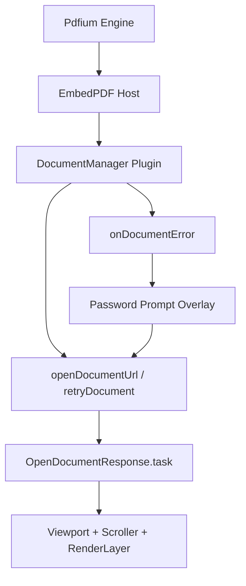
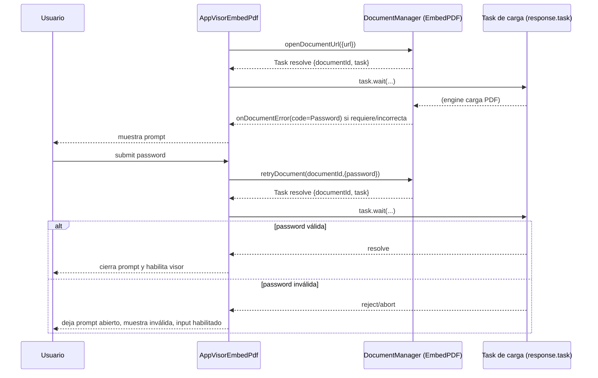

# SCRUMCORE-209 — Arquitectura Técnica

## Archivos impactados
- `src/app/Components/UI/AppVisorEmbedPdf/AppVisorEmbedPdf.tsx`
- `src/app/Components/UI/AppVisorEmbedPdf/presentation/AppPdfPasswordPrompt.tsx`
- `src/app/Components/UI/AppVisorEmbedPdf/presentation/AppPdfPasswordPrompt.module.css`
- `src/app/Components/UI/AppVisorEmbedPdf/hooks/useDemoPdfUrl.ts`
- `src/app/Components/UI/AppVisorEmbedPdf/AppVisorEmbedPdf.test.tsx`

## Diagrama de arquitectura (alto nivel)

## Flujo Password (secuencia)

## Notas técnicas (sostenibilidad)
- El “success/failure real” se toma de `OpenDocumentResponse.task`, no del task externo de `openDocumentUrl`/`retryDocument`.
- Se usa `onDocumentError` con `PdfErrorCode.Password` para mostrar prompt sin heurísticas de string.
- Cleanup: los handlers del task se “cancelan” al cambiar documento/unmount para evitar stale updates.

