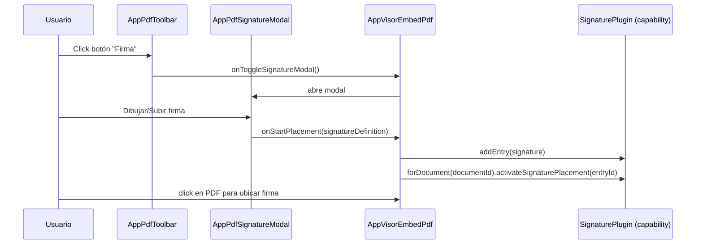

# SCRUMCORE-210 — Arquitectura Técnica

## Capas

- **UI Presentacional**
  - `AppPdfToolbar` (memoizada)
  - `AppPdfSignatureModal`
  - `States` (loading/error/empty)
- **Orquestación / Integración EmbedPDF**
  - `AppVisorEmbedPdf.tsx` integra engine + plugins + estados UI
- **Plugins oficiales (registro)**
  - `plugins/pluginRegistration.ts` registra paquetes oficiales vía `createPluginRegistration(...)`

## Rendering pipeline (alto nivel)

```mermaid
flowchart LR
  A[Pdfium Engine] --> B[EmbedPDF]
  B --> C[DocumentManager]
  C --> D[Viewport]
  D --> E[Scroller (virtualización)]
  E --> F[RenderLayer]
  E --> G[AnnotationLayer]
```

## Secuencia: firma (modal → placement)



## Estados relevantes

- Modal: abierto/cerrado.
- Bloqueo UX: bloqueado/desbloqueado.
- Selección: firma seleccionada o no (para habilitar “Eliminar”).

