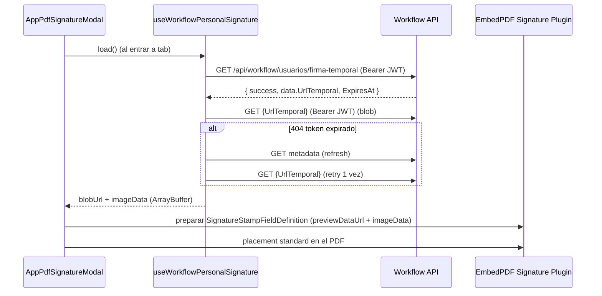

# SCRUMCORE-211 — Arquitectura Técnica

## Responsabilidades

- `AppVisorEmbedPdf` mantiene encapsulación de plugins y estado del visor.
- `AppPdfSignatureModal` contiene UI del modal y tabs.
- `useWorkflowPersonalSignature` encapsula consumo de API temporal y lifecycle de ObjectURL.
- `DocumentosWorkbench` no conoce la lógica (permanece limpio).

## Flujo técnico (Firma personal)

## Puntos de performance / memory

- Se utiliza `URL.createObjectURL(blob)` para preview.
- Se revoca con `URL.revokeObjectURL` al cerrar modal, al reintentar o al “usar firma”.

