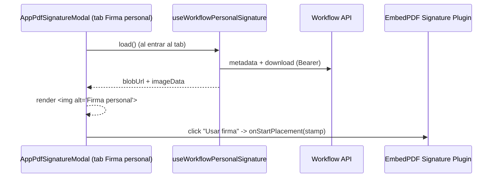

# SCRUMCORE-213 — Arquitectura Técnica

## Responsabilidades

- `useWorkflowPersonalSignature`: descarga `Blob` y crea `ObjectURL` (lifecycle controlado).
- `AppPdfSignatureModal`: renderiza preview y dispara placement vía `onStartPlacement`.
- Workbench: sin cambios.

## Flujo (UI simplificada)

