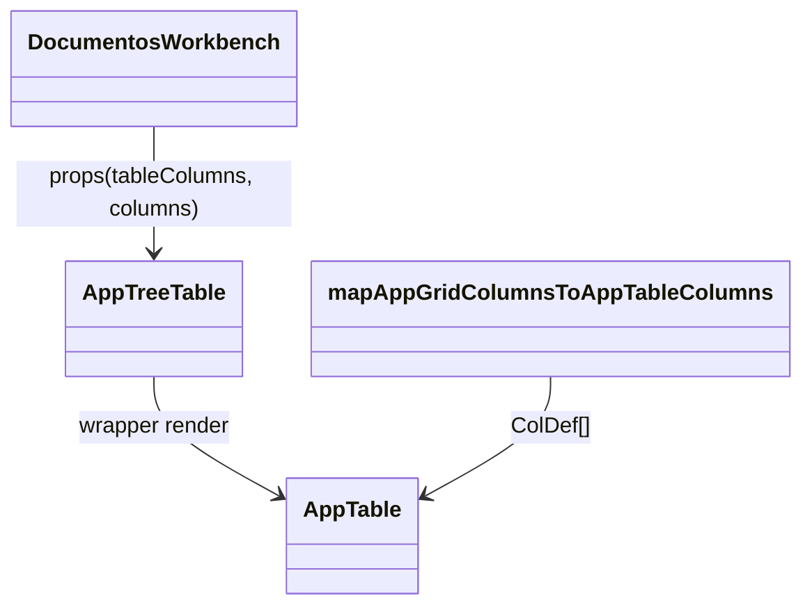
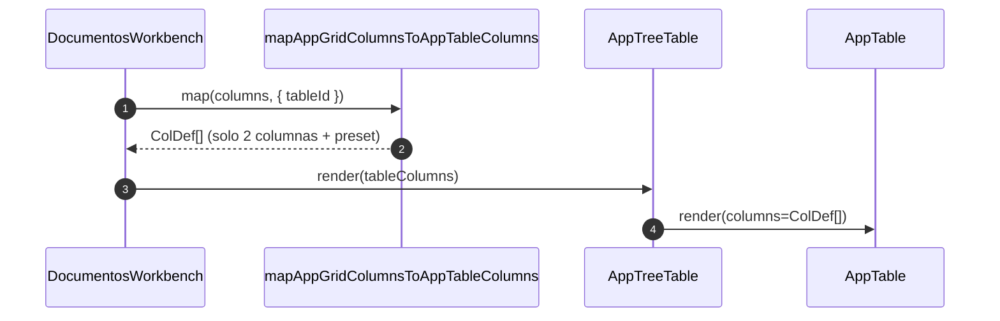
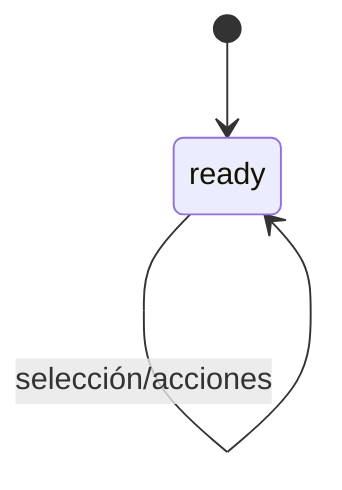

# SCRUMCORE-225 - Arquitectura

## 1. Resumen arquitectónico
- Objetivo técnico: asegurar que el listado del Workbench (DocumentosWorkbench → AppTreeTable → AppTable/AG Grid) renderice **solo 2 columnas funcionales** (Documento + Acciones) con sizing estable, sin alterar comportamiento funcional.
- Decisión principal: aplicar el ajuste en el pipeline backend-driven de columnas (Dynamic UI → `ColDef`) **scoped** por `tableId` del Workbench.
- Restricciones: no romper `AppTable`/`AppTreeTable`, no cambiar contratos backend, TypeScript strict, sin dependencias nuevas.

## 1.1 Alcance / No alcance
- En alcance: selección determinística de 2 columnas + preset de sizing únicamente para Workbench.
- No alcance: cambios de endpoint/DTO, cambios de actions (qué acciones hay o qué hacen), rediseño del layout Workbench, cambios de selección/teclado.

## 2. Vista estática (capas)
- components: `src/modules/gestionCorrespondencia/components/documentosWorkbench/DocumentosWorkbench.tsx`
- adapters: `src/app/Components/UI/AppTable/adapters/appGridToAppTableColumns.ts`
- tests: `src/app/Components/UI/AppTable/tests/appGridToAppTableColumns.test.ts`, `src/modules/gestionCorrespondencia/adapters/documentosWorkbenchResponseAdapter.test.ts`, `src/modules/gestionCorrespondencia/tests/DocumentosWorkbench.test.tsx`
- playwright: `playwright/gestionCorrespondencia/documentosWorkbench.columnas225.spec.ts`

## 2.1 Contratos relevantes (internos)
- Input del adapter: `AppGridColumn[]` (Dynamic UI) + `AppTableColumnAdapterOptions` (`tableId`, `menuActions`, `userClaims`, `onClientEvent`).
- Output del adapter: `ColDef<AppTableRow>[]` (AG Grid), consumido por `AppTable` y transitivamente por `AppTreeTable`.
- Scope del cambio: solo cuando `options.tableId === "InboxListaDocumentosRadicado"`.

## 3. Diagrama de clases

Tabla de responsabilidades:
| Elemento | Tipo | Responsabilidad | Archivo |
|---|---|---|---|
| DocumentosWorkbench | Component | Orquestación visual (visor + rail + tabla) | `src/modules/gestionCorrespondencia/components/documentosWorkbench/DocumentosWorkbench.tsx` |
| AppTreeTable | Component | Wrapper tree sobre AppTable | `src/app/Components/UI/AppTreeTable/AppTreeTable.tsx` |
| mapAppGridColumnsToAppTableColumns | Adapter | Transformación Dynamic UI → ColDefs + scoping Workbench (2 columnas + sizing) | `src/app/Components/UI/AppTable/adapters/appGridToAppTableColumns.ts` |

## 4. Diagrama de secuencia

## 5. Diagrama de estados (impacto UX)

## 6. ADRs resumidas
- ADR-225-01: el ajuste se implementa en el adapter de columnas (no en UI) para mantener desacople backend-driven.
- ADR-225-02: scoping por `tableId` para evitar regresiones en otras pantallas.
- ADR-225-03: anti-legacy en `flatDocuments` (SCRUM-209): evitar depender de columnas no garantizadas.

## 7. Riesgos técnicos y mitigaciones
- Backend cambia columnas: selector con fallback + tests unitarios.
- Regresión cross-screen: scoping estricto por `tableId`.
- Viewport estrecho: el ancho final puede estar dominado por texto/padding; mitigación: `flex` + `minWidth` + pruebas (unit + Playwright).

## 8. Trazabilidad a código
- Selector + preset: `src/app/Components/UI/AppTable/adapters/appGridToAppTableColumns.ts`
- Evidencia unit tests: `src/app/Components/UI/AppTable/tests/appGridToAppTableColumns.test.ts`
- Evidencia adapter Workbench: `src/modules/gestionCorrespondencia/adapters/documentosWorkbenchResponseAdapter.test.ts`
- Evidencia wiring Workbench: `src/modules/gestionCorrespondencia/tests/DocumentosWorkbench.test.tsx`
