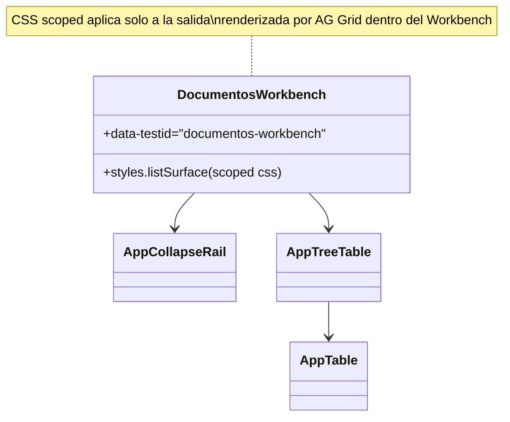
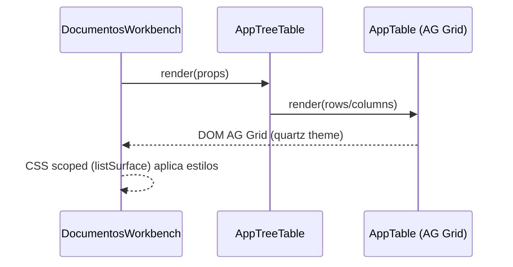
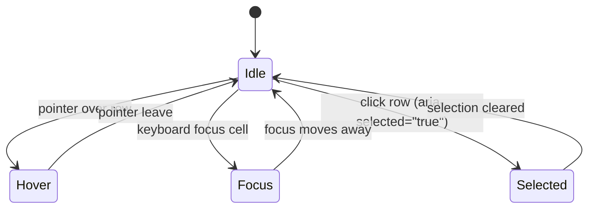

# SCRUMCORE-229 — Arquitectura (Ajuste Visual CSS-only de AppTreeTable en Workbench)

## Objetivo
Mejorar el aspecto visual del listado renderizado por `AppTreeTable` dentro del Workbench de documentos (**solo en este módulo**), logrando un look moderno/limpio/enterprise:

- Sin bordes/paneles pesados.
- Sin líneas verticales entre columnas (solo separadores de filas).
- Estados visuales claros (hover, focus, selected).
- Manteniendo el comportamiento y sizing de columnas existente desde el código.

## Restricciones (MUST)
- No modificar `AppTable` (`src/app/Components/UI/AppTable/**`).
- Mantener el layout/sizing de columnas (no ajustes de `width/minWidth/flex` desde `DocumentosWorkbench`).
- Cambios scopeados al Workbench de documentos (`data-testid="documentos-workbench"`).
- Mantener performance estable (sin selectores globales costosos, sin animar layout).

## Alcance / No alcance
### En alcance
- Estilos de AG Grid (Quartz) **solo dentro** de `DocumentosWorkbench`:
  - Header (tipografía, separadores, contraste).
  - Filas/celdas (separadores horizontales, hover, selected, focus).
  - Botón de acciones (ellipsis) en la celda de acciones (CSS-only).
  - Posicionamiento/espaciado del contenedor del listado dentro del rail.
- UX: el click sobre una fila debe seleccionarla completa (aplica estado `aria-selected="true"` a la fila).

### Fuera de alcance
- Cambiar columnas (cantidad, orden, sizing desde JS/TS).
- Cambios de backend/DTOs.
- Refactors funcionales de `AppTreeTable`/`AppTable`.

## Estrategia de scoping (evitar regresiones)
Los overrides de AG Grid se aplican únicamente bajo:

- `data-testid="documentos-workbench"` (raíz del Workbench)
- y el contenedor CSS module `styles.listSurface`

De esta forma los estilos de AG Grid **no se vuelven globales** y no afectan otras pantallas que usen `AppTable`.

## Diagramas (Mermaid)

### classDiagram

### sequenceDiagram

### stateDiagram-v2

