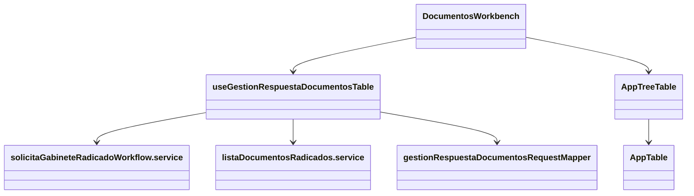
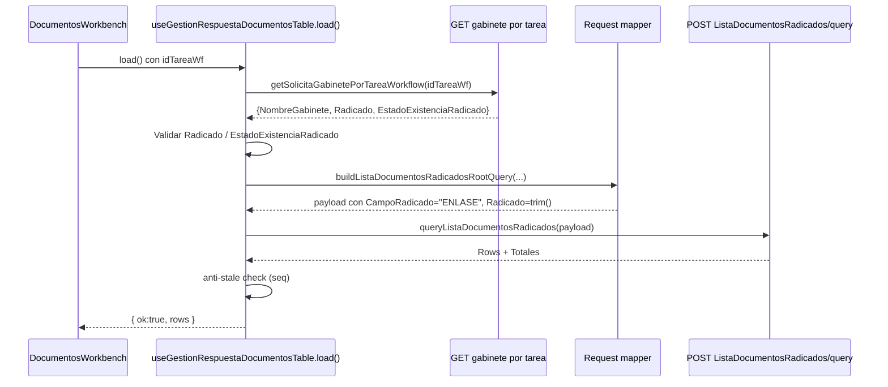
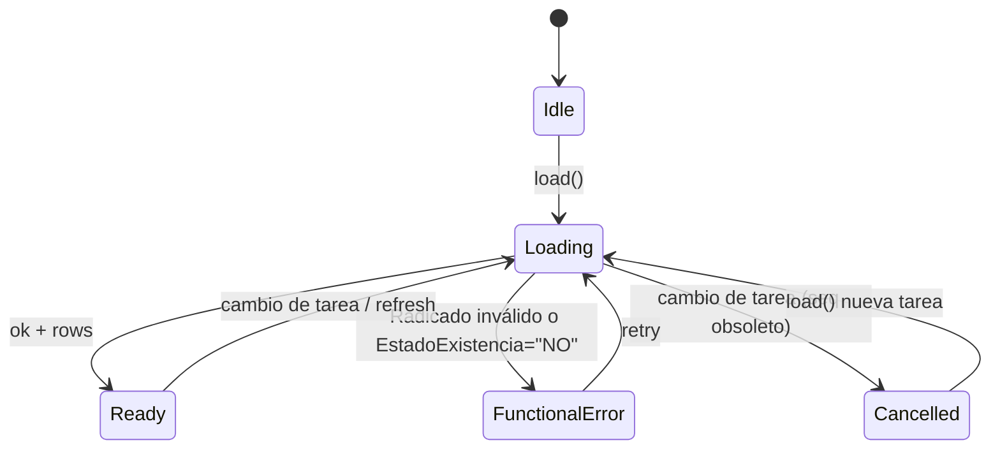

# SCRUMCORE-230 — Arquitectura (Corrección listado repetido + Radicado strict + anti-stale)

## 1) Problema (bug)
En `DocumentosWorkbench` el listado podía mostrar el **mismo set documental** al navegar entre tareas distintas.

**Síntomas observables**
- Se ven documentos repetidos al cambiar de tarea.
- En algunos casos el listado parecía “correcto” visualmente, pero realmente correspondía a **otra tarea** (datos stale).

**Causa raíz**
El frontend podía ejecutar `ListaDocumentosRadicados/query` sin un `Radicado` válido/effective:
- faltaba validación previa del `Radicado` como requisito,
- y/o el request terminaba sin filtro real por radicado,
lo que hacía que el backend respondiera con un set “general” del gabinete o resultados no aislados por tarea.

Adicionalmente, al cambiar rápido de tarea podían ocurrir **race conditions**:
- una respuesta “vieja” (tarea A) llegaba después y sobrescribía el estado para la tarea B.

## 2) Objetivo arquitectónico
Garantizar **aislamiento documental por tarea** con:
- `Radicado` como filtro **obligatorio** y validado,
- source of truth **único** (gabinete por tarea),
- estrategia anti-stale (no aplicar respuestas obsoletas),
- estabilidad UX (sin regresiones en selección múltiple, `ver_documento`, ni `loadChildren`).

## 3) Restricciones (MUST)
- No modificar backend, endpoints ni contratos.
- No romper `AppTreeTable`/`AppTable`.
- No romper selección múltiple, `loadChildren` ni `ver_documento`.
- No introducir dependencias.
- No usar `any`.

## 4) Source of Truth (Radicado)
El `Radicado` válido se obtiene **exclusivamente** de:
- `GET /api/workflow/ruta-trabajo/tareas/{idTareaWorkflow}/gabinete`
  - `getSolicitaGabinetePorTareaWorkflow(idTareaWf)`

Reglas:
- NO derivar `Radicado` desde UI.
- NO usar `Search` como reemplazo silencioso de `Radicado`.
- Solo ejecutar query de documentos si:
  - `Radicado.trim()` existe, y
  - `EstadoExistenciaRadicado !== "NO"` (case-insensitive).

## 5) Antistale / Concurrencia
Se usa un **secuenciador** en el hook (`loadSeqRef`) para identificar la ejecución más reciente.

Regla:
- Solo la última ejecución de `load()` puede aplicar estado.
- Si llega una respuesta de un `load()` obsoleto, se ignora.

Importante:
- Se evita el “flash” de error por cancelación: si la carga fue invalidada por cambio de tarea, no se considera un error funcional del usuario.

## 6) Diagrama (visión de dependencias)

## 7) Diagrama (secuencia de carga)

## 8) Diagrama (estado: loading / cancel / error)

