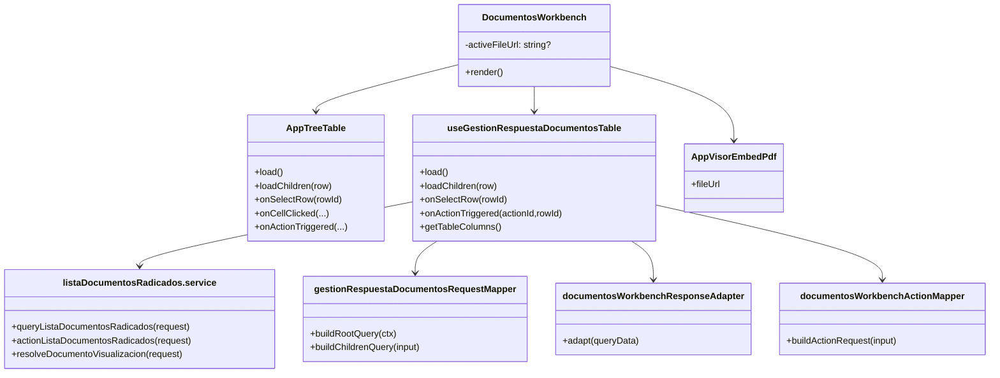
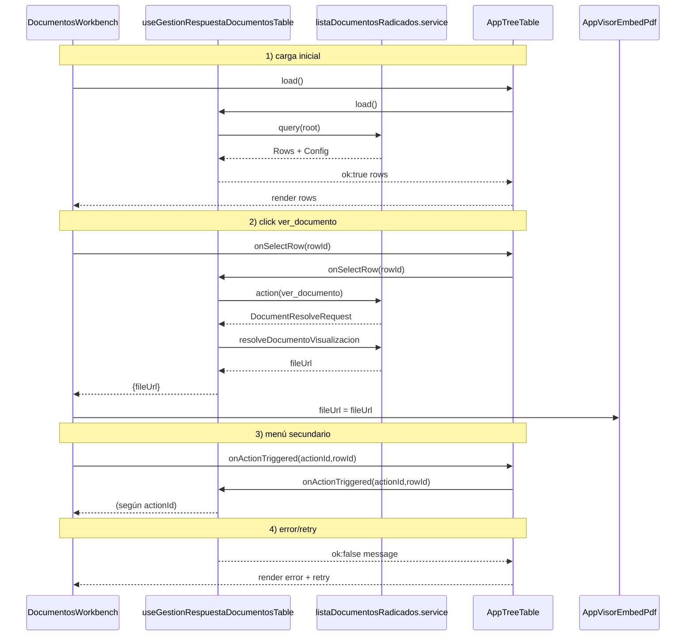
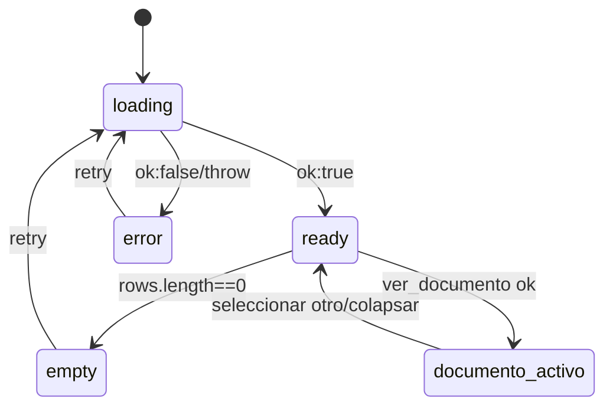

# SCRUMCORE-217 - Arquitectura

## 1. Resumen arquitectónico

Objetivo: integrar `DocumentosWorkbench` como panel backend-driven consumiendo el contrato `SCRUM-205 ListaDocumentosRadicados`, renderizando el árbol mediante `AppTreeTable` (wrapper de `AppTable`) y preservando layout visor (izquierda) + rail (derecha).

Decisiones:
- `DocumentosWorkbench` actúa como orquestador visual (layout + wiring + estado de documento activo).
- La consulta backend y la orquestación viven en un hook dedicado.
- El mapeo DTO → UI models vive en adapters dedicados (Clean Architecture).
- `AppTreeTable` mantiene responsabilidad de render jerárquico; solo se extiende su API para eventos (sin romper consumidores).

Restricciones:
- Sin `any`, sin axios directo en `DocumentosWorkbench`, sin hardcodear columnas/acciones.
- No romper `AppTable`, `AppTreeTable`, `AppVisorEmbedPdf`, `AppCollapseRail`, responsive.

## 2. Vista estática

Capas:
- components: `DocumentosWorkbench` (layout + wiring)
- hooks: `useGestionRespuestaDocumentosTable` (loading/query/actions)
- adapters: request/response/action mapping
- services: HTTP a endpoints SCRUM-205
- types: DTOs de SCRUM-205
- style: CSS modules ya existentes

## 3. Diagramas de clases

Tabla de responsabilidades:

| Elemento | Tipo | Responsabilidad | Archivo |
|---|---|---|---|
| DocumentosWorkbench | component | Layout visor+rail, wiring, estado documento activo | `src/modules/gestionCorrespondencia/components/documentosWorkbench/DocumentosWorkbench.tsx` |
| useGestionRespuestaDocumentosTable | hook | Query root/children + actions + memoización | `src/modules/gestionCorrespondencia/hooks/useGestionRespuestaDocumentosTable.ts` |
| gestionRespuestaDocumentosRequestMapper | adapter | Construir payloads de query SCRUM-205 | `src/modules/gestionCorrespondencia/adapters/gestionRespuestaDocumentosRequestMapper.ts` |
| documentosWorkbenchResponseAdapter | adapter | Rows/Meta → `AppTreeTableRow` + columnas dinámicas | `src/modules/gestionCorrespondencia/adapters/documentosWorkbenchResponseAdapter.ts` |
| documentosWorkbenchActionMapper | adapter | ActionId → request (ver_documento) | `src/modules/gestionCorrespondencia/adapters/documentosWorkbenchActionMapper.ts` |
| listaDocumentosRadicados.service | service | HTTP endpoints SCRUM-205 + resolve | `src/modules/gestionCorrespondencia/services/listaDocumentosRadicados.service.ts` |

## 4. Diagramas de secuencia

## 5. Diagramas de estados

## 6. ADRs resumidas

- ADR-217-01: Orquestación en hook + adapters, UI sin DTOs.
- ADR-217-02: `AppTreeTable` se usa como wrapper; no se reimplementa tabla.

## 7. Riesgos técnicos y mitigaciones

- Riesgo: acoplar UI a DTO backend → Mitigación: adapters estrictos y tests unitarios.
- Riesgo: re-render masivo / jitter → Mitigación: memoización en hook y wrapper, evitar recrear handlers.

## 8. Trazabilidad a código

- Implementación: `src/modules/gestionCorrespondencia/components/documentosWorkbench/DocumentosWorkbench.tsx`
- Hook: `src/modules/gestionCorrespondencia/hooks/useGestionRespuestaDocumentosTable.ts`
- Adapters: `src/modules/gestionCorrespondencia/adapters/*`
- Services: `src/modules/gestionCorrespondencia/services/listaDocumentosRadicados.service.ts`
