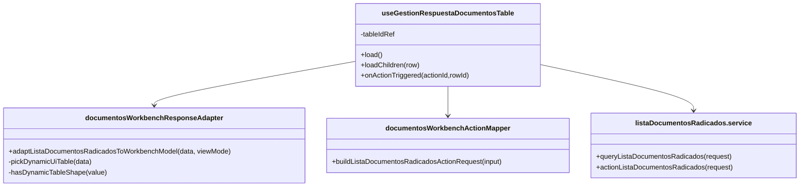
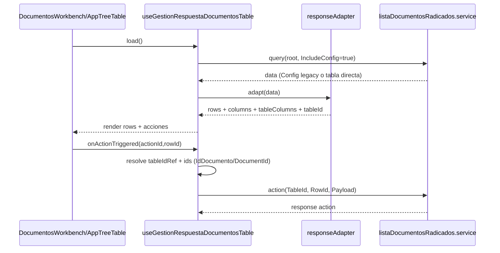

# SCRUMCORE-218 - Arquitectura

## 1. Resumen arquitectónico

Objetivo: normalizar el consumo de `ListaDocumentosRadicados` para soportar dos shapes del backend (`data.Config` legacy y `data` directo), preservando render de acciones y disparo correcto de `onActionTriggered` en `DocumentosWorkbench`.

Decisiones:
- La normalización de shape se concentra en `documentosWorkbenchResponseAdapter` (`pickDynamicUiTable`).
- `useGestionRespuestaDocumentosTable` conserva `tableId` efectivo en un `ref` (valor backend o fallback estable).
- El request de `action` se normaliza en adapter dedicado, priorizando `IdDocumento` sobre `DocumentId`.
- Se mantiene `IncludeConfig: true` en query root para compatibilidad con dynamic config.

Restricciones:
- No se modifica backend ni rutas.
- No se rompe compatibilidad con `data.Config`.
- No se cambian contratos TS públicos salvo ampliación compatible.

## 2. Vista estática

Capas involucradas:
- `adapters`: normalización de respuesta y request de acción
- `hooks`: orquestación de load/children/actions y `tableId` efectivo
- `services`: consumo HTTP existente sin cambios de endpoint
- `tests`: cobertura de ambos shapes y preservación de acciones

## 3. Diagramas de clases

## 4. Diagramas de secuencia

## 5. ADRs resumidas

- ADR-218-01: Soporte dual de shape backend en un único adapter (evita bifurcar pipelines).
- ADR-218-02: `tableIdRef` como source-of-truth para action request.
- ADR-218-03: Prioridad determinística de identificador (`IdDocumento` > `DocumentId`).

## 6. Riesgos técnicos y mitigaciones

- Riesgo: respuesta parcial no identificada como tabla dinámica.
  - Mitigación: detección por `TableId`/colecciones de acciones/columnas objeto.
- Riesgo: discrepancias de identificador entre `Meta` y `Values`.
  - Mitigación: lectura en ambos orígenes con prioridad definida.
- Riesgo: pérdida de acciones cuando `RowActions` viene vacío.
  - Mitigación: preservación explícita de `CellActions` + `MenuActions`.

## 7. Trazabilidad a código

- `src/modules/gestionCorrespondencia/adapters/documentosWorkbenchResponseAdapter.ts`
- `src/modules/gestionCorrespondencia/hooks/useGestionRespuestaDocumentosTable.ts`
- `src/modules/gestionCorrespondencia/adapters/documentosWorkbenchActionMapper.ts`
- `src/modules/gestionCorrespondencia/adapters/documentosWorkbenchResponseAdapter.test.ts`
- `src/modules/gestionCorrespondencia/adapters/documentosWorkbenchActionMapper.test.ts`
