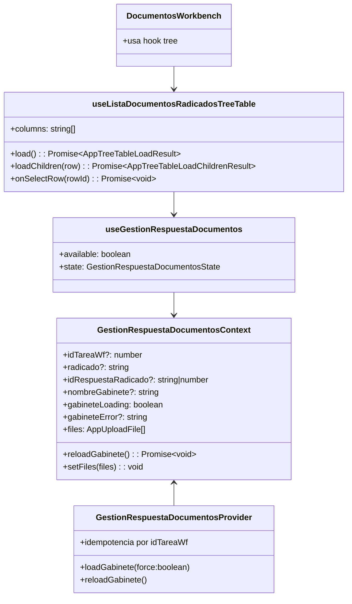
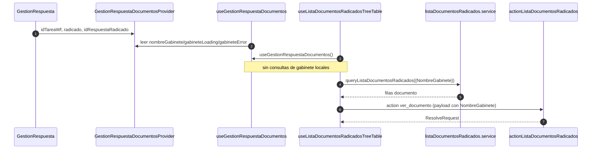
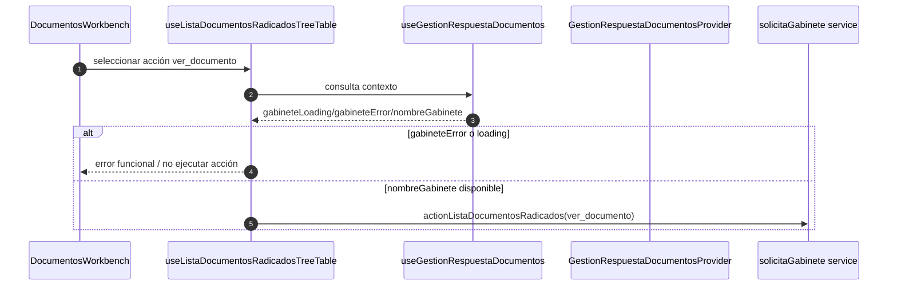
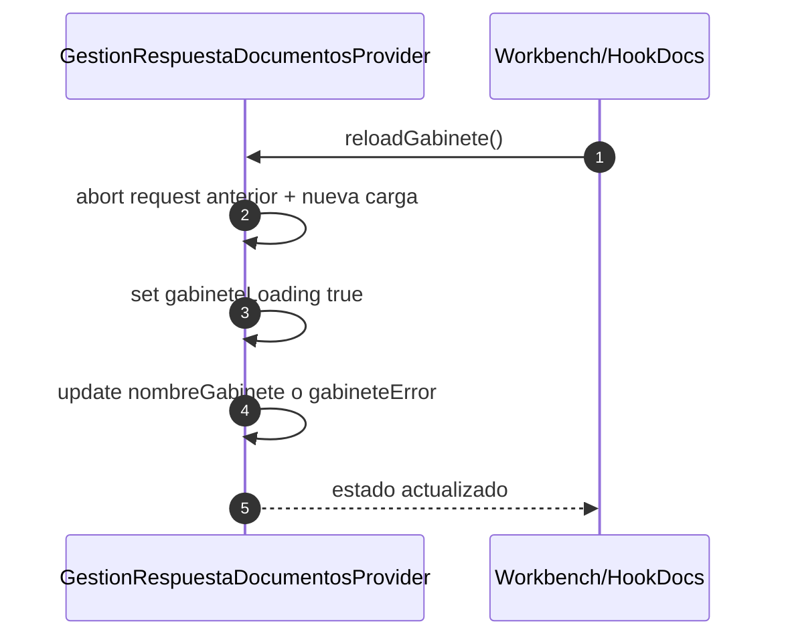
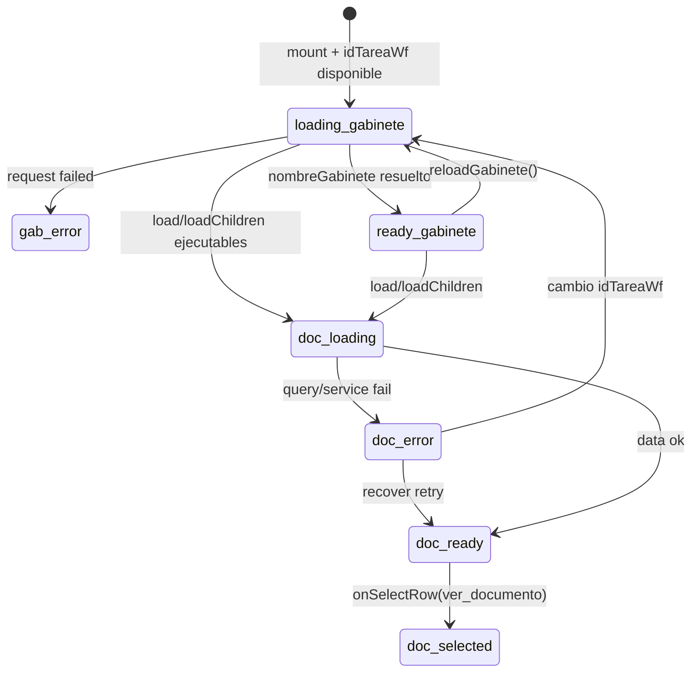

# SCRUMCORE-221 - Arquitectura

## 1. Resumen arquitectonico

SCRUMCORE-221 elimina la resolución local de gabinete en el hook de documentos y lo desacopla para consumir la fuente transversal `GestionRespuestaDocumentosContext`.

Objetivo técnico:

- Consumir `nombreGabinete` desde contexto, evitando `getSolicitaGabinetePorTareaWorkflow` en `useListaDocumentosRadicadosTreeTable`.
- Mantener inalterados `load`, `loadChildren`, acciones y contratos de AppTreeTable.
- Reducir duplicación de fetches, evitar condiciones de carrera y preservar integración con `DocumentosWorkbench`, visor y acciones existentes.

Decisiones:

- Mantener el hook exclusivamente orquestando query/acciones documentales.
- Mantener la resolución de gabinete en contexto (`GestionRespuestaDocumentosContext`) ya refactorizado en SCRUMCORE-220.
- Mantener fallback funcional controlado cuando no existe `nombreGabinete`.
- Respetar estado transversal mínimo para prevenir god context.

Restricciones:

- No cambiar endpoints ni contratos de query/action.
- No cambiar layout ni lógica de AppTreeTable.
- No duplicar resolución de gabinete.
- No introducir cambios de UI.
- No introducir `any`.

## 2. Vista estatica

Capas:

- `context`: `GestionRespuestaDocumentosContext` mantiene estado transversal documental.
- `hooks`: `useListaDocumentosRadicadosTreeTable` consume estado transversal y conserva contrato de AppTreeTable.
- `services`: `listaDocumentosRadicados.service` y `solicitaGabineteRadicadoWorkflow.service`.
- `components`: `DocumentosWorkbench` consume el hook y su output documental.
- `tests`: validaciones unitarias para fallback funcional, consumo de contexto y bloqueo por estado de gabinete.

## 3. Diagrama de clases

## 4. Diagramas de secuencia

## 5. Diagramas de estados

## 6. ADRs resumidas

- ADR-221-01: el contexto es único origen de verdad para `nombreGabinete`.
- ADR-221-02: `useListaDocumentosRadicadosTreeTable` permanece como orquestador documental, no como resolver transversal.
- ADR-221-03: la acción `ver_documento` validará estado de gabinete antes de ejecutar.
- ADR-221-04: fallback funcional con mensajes claros en español en vez de romper render.

## 7. Riesgos técnicos y mitigaciones

- Doble fuente de verdad: se elimina consulta local de gabinete en el hook.
- Race conditions al cambiar tarea: mitigado por `gabineteLoading`/`gabineteError` y contexto unificado.
- Desincronía árbol/visor: mitigado mediante bloqueo de acciones dependientes al no tener `nombreGabinete`.
- Re-render masivo: se mantienen dependencias de hook acotadas, sin nuevos estados de UI.
- Error de contrato de acción: se preserva payload y `ActionId`.

## 8. Trazabilidad a codigo

- `src/modules/gestionCorrespondencia/context/GestionRespuestaDocumentosContext.tsx`
- `src/modules/gestionCorrespondencia/hooks/useGestionRespuestaDocumentos.ts`
- `src/modules/gestionCorrespondencia/hooks/useListaDocumentosRadicadosTreeTable.ts`
- `src/modules/gestionCorrespondencia/tests/useListaDocumentosRadicadosTreeTable.test.tsx`
- `src/modules/gestionCorrespondencia/components/documentosWorkbench/DocumentosWorkbench.tsx` (wire del hook)
