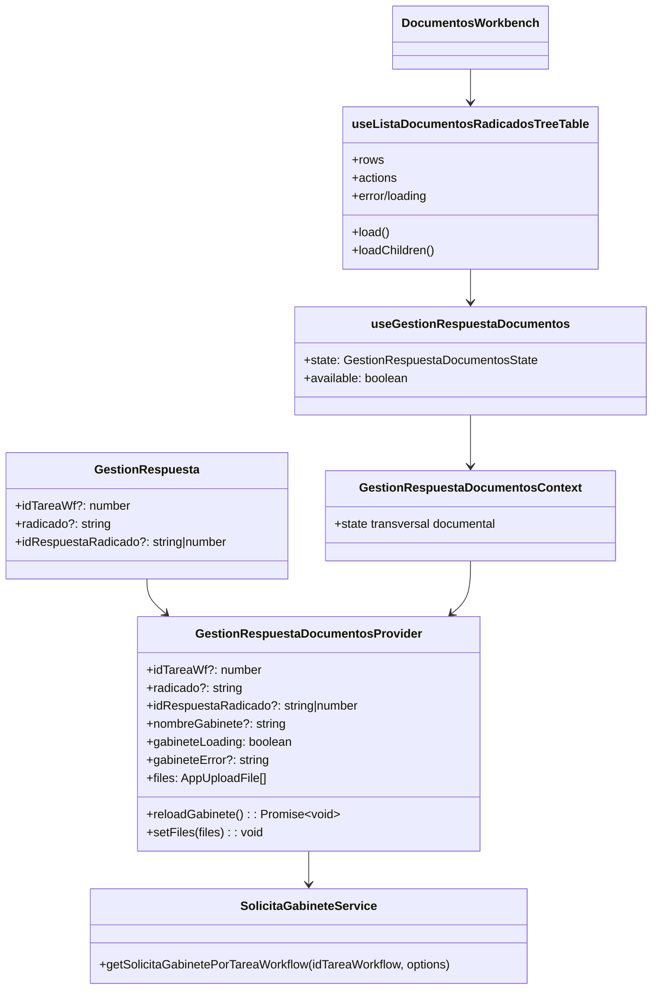
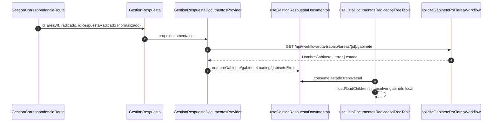
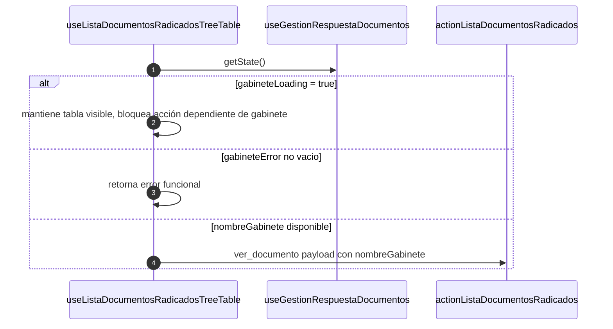
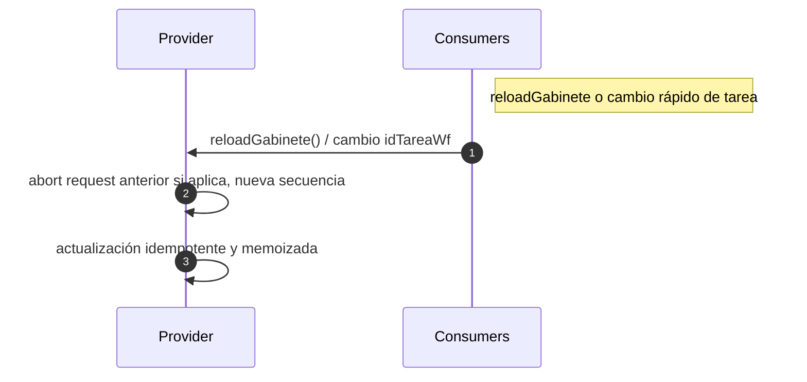
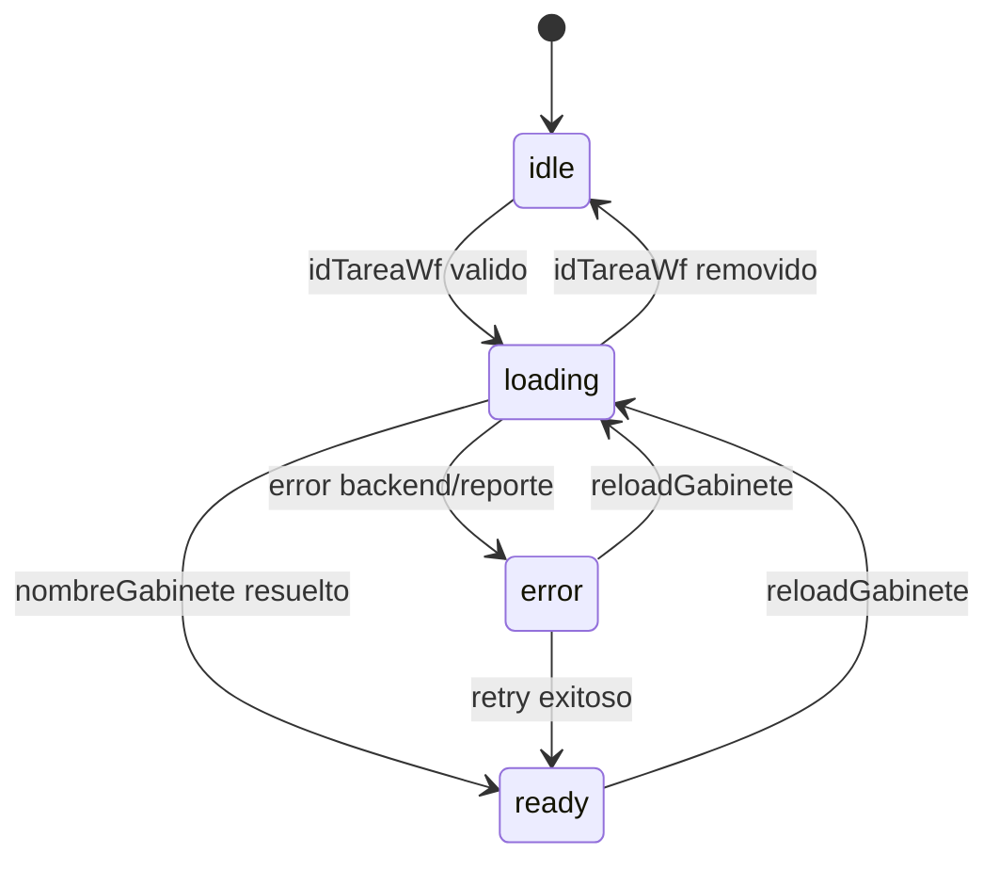

# SCRUMCORE-222 - Arquitectura

## 1. Resumen arquitectonico

SCRUMCORE-222 cierra el ciclo de hardening del refactor transversal de `GestionRespuesta`, validando la estabilidad luego de:

- `SCRUMCORE-219` (normalización y tipado de `idRespuestaRadicado`).
- `SCRUMCORE-220` (contexto transversal documental).
- `SCRUMCORE-221` (hook de documentos consume `GestionRespuestaDocumentosContext`).

No introduce nuevas funcionalidades, cambios de endpoint ni modificaciones de contrato público del producto.

Objetivo técnico:

- Consolidar trazabilidad runtime entre `estructura por tarea` → `contexto transversal` → `árbol documental` → `visor PDF` → `adjuntos`.
- Confirmar idempotencia y estabilidad del estado transversal sin convertirlo en god context.
- Cerrar documentación enterprise con evidencias de pruebas y riesgos residuales.

Decisiones:

- Mantener el contexto como capa de estado documental transversal y no como contenedor funcional del módulo.
- Mantener el hook documental como orquestador de query/actions, sin resolver gabinete localmente.
- Mantener `files/setFiles` en el contexto para compatibilidad de adjuntos.
- Aplicar validación funcional de `ver_documento` en presencia de `gabineteLoading`/`gabineteError` sin romper render del árbol.

Restricciones:

- No cambiar backend ni contratos de endpoint.
- No cambiar UI funcional.
- No introducir `any`.
- No duplicar request de gabinete ni fetch local en `useListaDocumentosRadicadosTreeTable`.

## 2. Vista estatica

Capas revisadas:

- `context`: estado transversal (`GestionRespuestaDocumentosContext`) con carga de gabinete, flags y fallback.
- `hooks`: `useGestionRespuestaDocumentos` y `useListaDocumentosRadicadosTreeTable`.
- `services`: `solicitaGabinetePorTareaWorkflow` (fuente única de gabinete).
- `pages`: `GestionRespuesta` (inyecta contexto con `idTareaWf`, `radicado`, `idRespuestaRadicado`).
- `components`: `DocumentosWorkbench`.
- `adapters`: `mapEstructuraRespuesta` (normalización de estructura por tarea, 219).
- `tests`: unit/integración para contexto, tabla documental y comportamiento de visor con contexto.

## 3. Diagrama de clases

## 4. Diagramas de secuencia

## 5. Diagrama de estados

## 6. ADRs resumidas

- ADR-222-01: El estado documental transversal se mantiene acotado, evitando god context.
- ADR-222-02: La consulta de gabinete vive en `GestionRespuestaDocumentosProvider` y su `service`; el hook documental no consulta backend por gabinete.
- ADR-222-03: `reloadGabinete` usa idempotencia + control de secuencia y `AbortController`.
- ADR-222-04: La integración entre vista y acciones se conserva para evitar regresión en `AppTreeTable` y `AppVisorEmbedPdf`.

## 7. Riesgos tecnicos y mitigaciones

- Riesgo: re-fetch innecesario por cambios de `idTareaWf`.
  - Mitigación: cache por `loadedTaskRef` + `force` en reload.
- Riesgo: estado stale por peticiones concurrentes.
  - Mitigación: secuencia (`requestSeqRef`) + `AbortController`.
- Riesgo: desincronización de acciones con gabinete.
  - Mitigación: validación de `nombreGabinete` en acción `ver_documento`.
- Riesgo: regresión de adjuntos/visor.
  - Mitigación: `files/setFiles` sin cambios de contrato y tests de integración en suite existente.

## 8. Trazabilidad a codigo

- `src/modules/gestionCorrespondencia/context/GestionRespuestaDocumentosContext.tsx`
- `src/modules/gestionCorrespondencia/hooks/useGestionRespuestaDocumentos.ts`
- `src/modules/gestionCorrespondencia/hooks/useListaDocumentosRadicadosTreeTable.ts`
- `src/modules/gestionCorrespondencia/components/documentosWorkbench/DocumentosWorkbench.tsx`
- `src/modules/gestionCorrespondencia/services/solicitaGabineteRadicadoWorkflow.service.ts`
- `src/modules/gestionCorrespondencia/tests/useGestionRespuestaDocumentos.test.tsx`
- `src/modules/gestionCorrespondencia/tests/useGestionRespuestaDocumentosTable.test.tsx`
- `src/modules/gestionCorrespondencia/tests/useListaDocumentosRadicadosTreeTable.test.tsx`
- `src/modules/gestionCorrespondencia/tests/DocumentosWorkbench.test.tsx`
