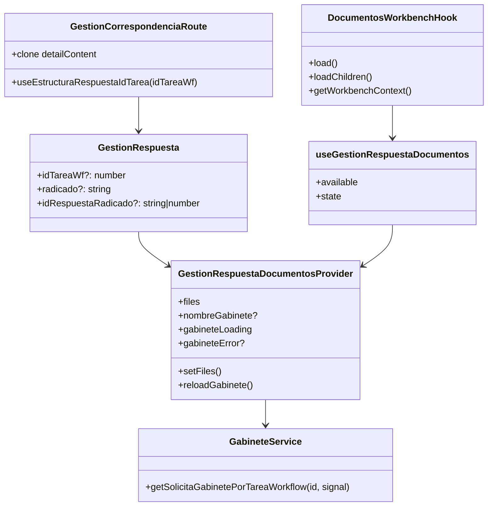
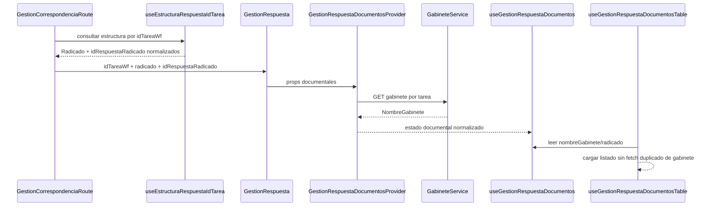
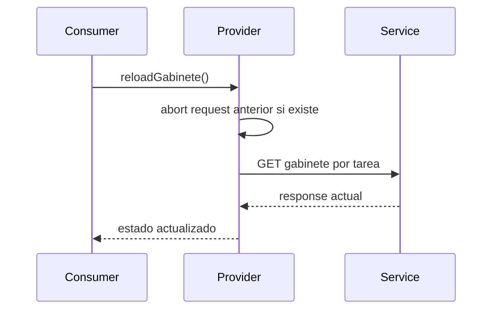
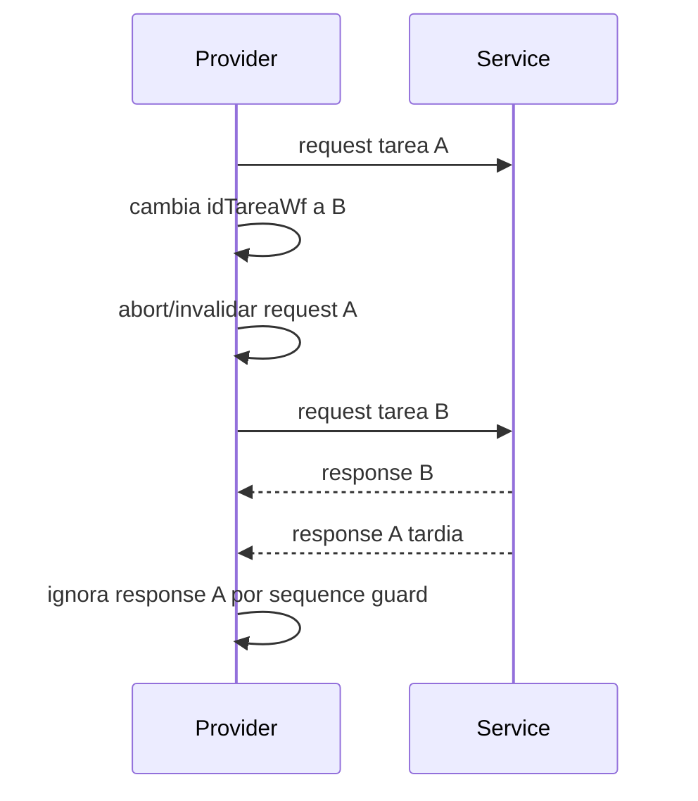
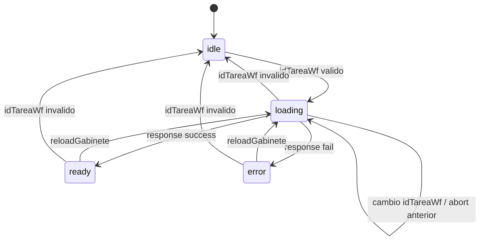

# SCRUMCORE-220 - Arquitectura

## 1. Resumen arquitectonico

SCRUMCORE-220 refactoriza `GestionRespuestaDocumentosContext` como contexto transversal documental para `GestionRespuesta`.

Objetivo tecnico:

- Centralizar `idTareaWf`, `radicado`, `idRespuestaRadicado`, `nombreGabinete`, `gabineteLoading`, `gabineteError`, `reloadGabinete`, `files` y `setFiles`.
- Evitar fetches duplicados de gabinete en el flujo principal del visor/documentos.
- Mantener compatibilidad con adjuntos mediante `files/setFiles`.
- Preservar visor PDF, `DocumentosWorkbench` y consumidores actuales.

Decisiones:

- `GestionCorrespondenciaRoute` es el punto que obtiene `radicado` e `idRespuestaRadicado` desde `useEstructuraRespuestaIdTarea`.
- `GestionRespuesta` solo recibe esos datos y los pasa al provider.
- `GestionRespuestaDocumentosProvider` resuelve `nombreGabinete` usando el service existente.
- `useGestionRespuestaDocumentosTable` deja de consultar gabinete directamente y consume el contexto.
- El contexto no absorbe formularios, flags visuales ni reglas de negocio.

Restricciones:

- No usar `any`.
- No cambiar endpoints backend.
- No modificar UI visual.
- No usar axios directo en componentes para gabinete.
- No convertir el contexto en god context.

## 2. Vista estatica

Capas:

- `routes`: obtiene estructura por tarea y entrega datos normalizados al detail.
- `pages`: cablea props hacia el provider.
- `context`: mantiene estado documental transversal y ciclo de vida de gabinete.
- `hooks`: exponen estado seguro y consumen contexto.
- `services`: ejecutan HTTP hacia backend.
- `tests`: validan contrato, idempotencia, reload, error y regresion.

## 3. Diagrama de clases

## 4. Diagrama de secuencia

Reload explicito:

Cambio rapido de tarea:

## 5. Diagrama de estados

## 6. ADRs resumidas

- ADR-001: Contexto transversal documental acotado. Se rechaza usarlo como store global del modulo.
- ADR-002: Source of truth en ruta/pagina. `radicado` e `idRespuestaRadicado` vienen del flujo normalizado de estructura por tarea.
- ADR-003: Idempotencia por `idTareaWf`. No se refetchea automaticamente si el id no cambia.
- ADR-004: Cancelacion + sequence guard. Evita stale updates y memory leaks.
- ADR-005: Compatibilidad de adjuntos. `files/setFiles` se conservan sin cambio semantico.

## 7. Riesgos tecnicos y mitigaciones

- God context: contrato publico limitado a estado documental transversal.
- Doble fetch de gabinete: `useGestionRespuestaDocumentosTable` consume contexto.
- Race conditions: `AbortController` y `requestSeqRef`.
- Error backend: `gabineteError` no rompe render.
- Perdida de adjuntos: `files/setFiles` se mantienen en provider.

## 8. Trazabilidad a codigo

- `src/modules/gestionCorrespondencia/routes/GestionCorrespondenciaRoute.tsx`
- `src/modules/gestionCorrespondencia/pages/GestionRespuesta.tsx`
- `src/modules/gestionCorrespondencia/context/GestionRespuestaDocumentosContext.tsx`
- `src/modules/gestionCorrespondencia/hooks/useGestionRespuestaDocumentos.ts`
- `src/modules/gestionCorrespondencia/hooks/useGestionRespuestaDocumentosTable.ts`
- `src/modules/gestionCorrespondencia/services/solicitaGabineteRadicadoWorkflow.service.ts`
