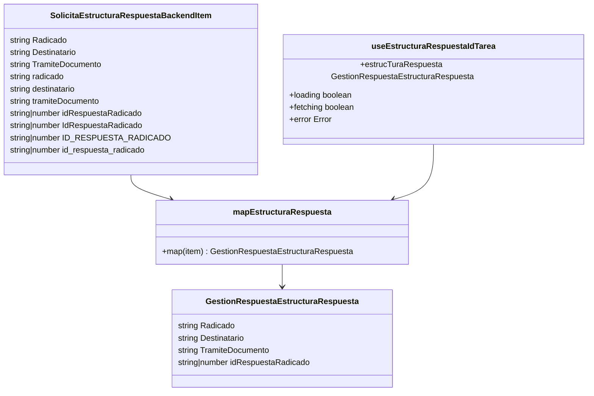
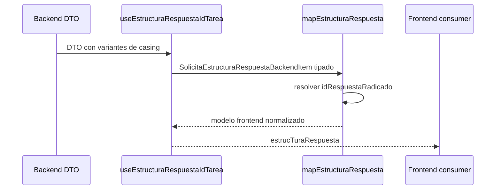
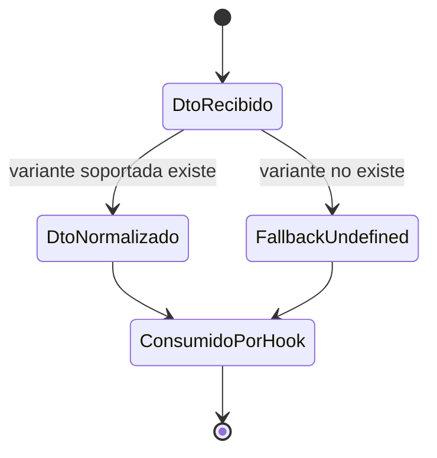

# SCRUMCORE-219 - Arquitectura

## 1. Resumen arquitectonico

Objetivo tecnico: incorporar soporte tipado y normalizacion de `idRespuestaRadicado` en el flujo de estructura por tarea, sin cambiar UI, endpoints, contratos backend ni reglas de negocio.

Decisiones:

- El DTO backend acepta variantes de casing documentadas.
- El modelo frontend expone solo `idRespuestaRadicado`.
- `mapEstructuraRespuesta` es el unico punto de normalizacion.
- `useEstructuraRespuestaIdTarea` consume el modelo normalizado y no conoce variantes backend.
- El fallback es ausencia del campo, observable como `undefined`.

Restricciones:

- No usar `any`.
- No cambiar endpoints.
- No propagar casing backend a componentes.
- No introducir cambios visuales.

## 2. Vista estatica

Capas:

- `types`: define DTO backend compatible y modelo frontend normalizado.
- `adapters`: traduce variantes backend a `idRespuestaRadicado`.
- `hooks`: obtiene la respuesta y entrega estructura normalizada.

## 3. Diagrama de clases

## 4. Diagrama de secuencia

## 5. Diagrama de estados

## 6. ADRs resumidas

ADR-001: Normalizacion centralizada en adapter.

- Motivo: evitar duplicacion de reglas de casing.
- Consecuencia: hooks y componentes solo usan el modelo frontend.

ADR-002: No propagar casing backend.

- Motivo: reducir acoplamiento con contratos legacy.
- Consecuencia: nuevos consumidores acceden unicamente a `idRespuestaRadicado`.

ADR-003: Fallback undefined.

- Motivo: `0`, string vacio o `NaN` pueden confundirse con valores reales.
- Consecuencia: ausencia real se representa con `undefined`.

## 7. Riesgos tecnicos y mitigaciones

- Varias variantes en el mismo DTO -> precedencia deterministica documentada.
- Variante backend no soportada -> fallback `undefined` y sin crash.
- Tests exactos de shape legacy -> el campo opcional no se materializa cuando falta.
- Acceso inseguro desde hook -> payload tipado antes de invocar mapper.

## 8. Trazabilidad a codigo

- `src/modules/gestionCorrespondencia/types/gestionRespuestaEstructura.types.ts`
- `src/modules/gestionCorrespondencia/adapters/mapEstructuraRespuesta.ts`
- `src/modules/gestionCorrespondencia/hooks/useEstructuraRespuestaIdTarea.ts`
- `src/modules/gestionCorrespondencia/adapters/mapEstructuraRespuesta.test.ts`
- `src/modules/gestionCorrespondencia/tests/useEstructuraRespuestaIdTarea.test.tsx`
