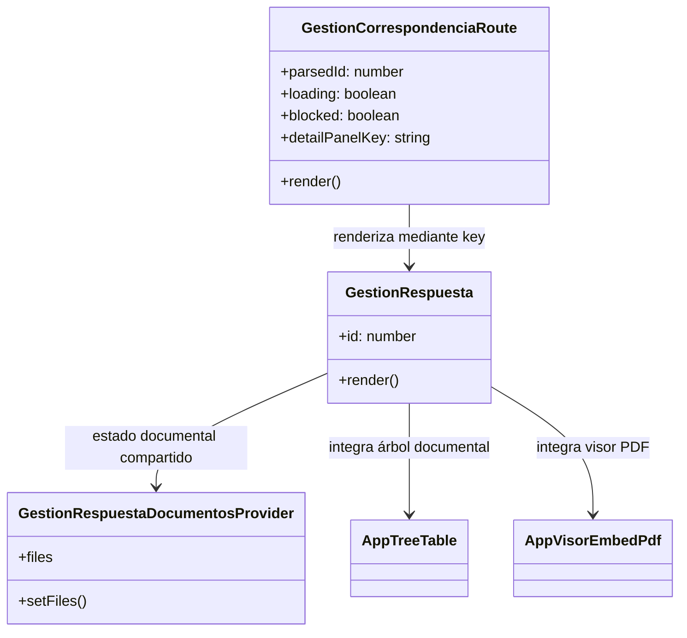
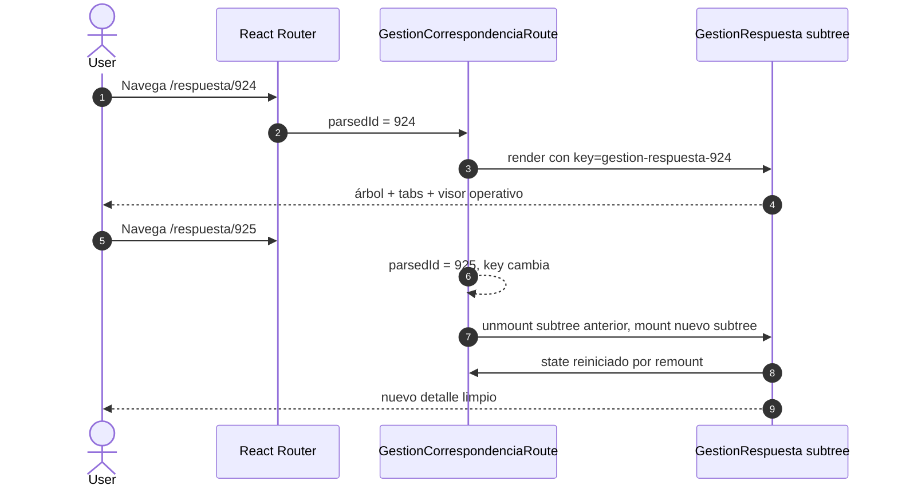
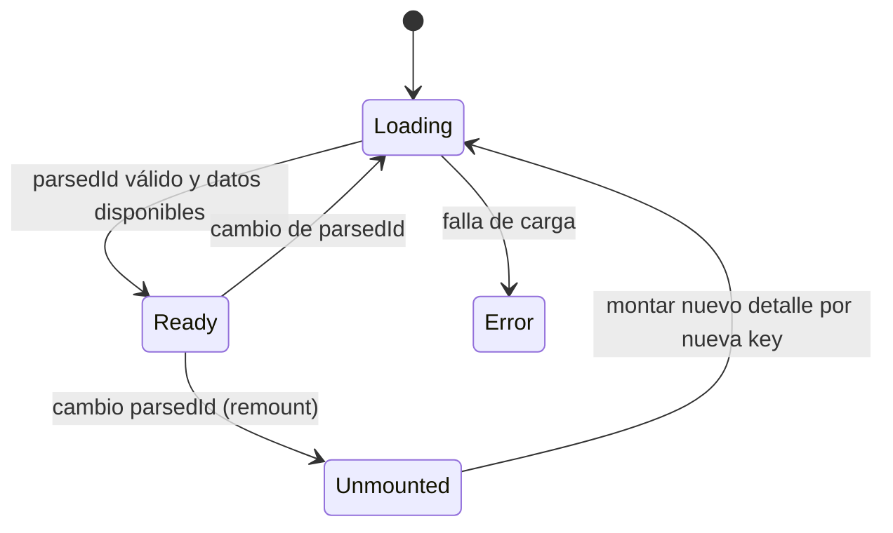

# SCRUMCORE-231 - Arquitectura

## 1. Resumen arquitectónico

### Objetivo técnico
Aislar completamente el árbol de detalle `GestionRespuesta` cuando cambia `:id` en:
`/dashboard/gestion-correspondencia/respuesta/:id`, para evitar contaminación de estado entre tareas.

### Decisiones
- **Remount por identidad**: usar `key` determinística derivada de `parsedId` en el contenedor de detalle de ruta.
- **Sin nuevos endpoints**: no tocar contratos backend ni servicios.
- **Alcance acotado**: cambios solo en capa de composición de ruta y pruebas.
- **Compatibilidad preservada**: no cambiar comportamiento de AppTable/AppTreeTable/visor/adjuntos.

### Restricciones
- Sin cambios de backend.
- Sin cambios de contratos públicos funcionales.
- Sin `any`.
- Sin hacks de reseteo manual por setState global.
- Sin impacto visible en lógica de tabs de `GestionRespuesta`.

## 2. Vista estática

### Capas involucradas
- **Routes**: `src/modules/gestionCorrespondencia/routes/GestionCorrespondenciaRoute.tsx`
- **Pages**: `src/modules/gestionCorrespondencia/pages/GestionRespuesta.tsx`
- **Context**: `src/modules/gestionCorrespondencia/context/GestionRespuestaDocumentosContext.tsx` (sin cambio en este ticket)
- **Hooks**: `src/modules/gestionCorrespondencia/hooks/*`
- **Components**:
  - `src/modules/gestionCorrespondencia/components/documentosWorkbench/*`
  - `src/modules/gestionCorrespondencia/components/AppVisorEmbedPdf` (consumo indirecto)
- **Tests**: `src/modules/gestionCorrespondencia/routes/GestionCorrespondenciaRoute.spec.test.tsx`

## 3. Diagramas de clases

## 4. Diagramas de secuencia

## 5. Diagramas de estados

## 6. ADRs resumidas

### ADR-231-01: Key-based remount
**Decisión:** Forzar identidad de React por `parsedId` para aislar estado.  
**Justificación:** Evita estado residual (visor, archivo activo, editor, selección) entre tareas.

### ADR-231-02: Sin cambios de endpoint
**Decisión:** Mantener contratos backend intactos.  
**Justificación:** Este ticket es hardening de lifecycle, no de negocio.

### ADR-231-03: Pruebas antes de expansión
**Decisión:** Validar primero con pruebas unitarias de remount y después ampliar regresiones manuales/integración.  
**Justificación:** Minimiza riesgo de regresión silenciosa.

## 7. Riesgos técnicos y mitigaciones
- Riesgo: remount parcial (clave en nodo incorrecto) → Mitigado ubicando `key` en el contenedor padre del árbol de detalle completo.
- Riesgo: estado residual de requests async → Mitigación futura en pruebas de navegación rápida y revisión de cleanup (fase de hardening posterior).
- Riesgo: regressiones invisibles en AppTreeTable/visor → Mitigación con checklist explícito de regresión y pruebas de interacción.
- Riesgo: foco/flujo de navegación inestable → Mitigación sin cambios en flujo de shell y pruebas de navegación por teclado.

## 8. Trazabilidad a código
- `src/modules/gestionCorrespondencia/routes/GestionCorrespondenciaRoute.tsx` (key de remount y render condicionado)
- `src/modules/gestionCorrespondencia/routes/GestionCorrespondenciaRoute.spec.test.tsx` (pruebas de remount y estado local)
