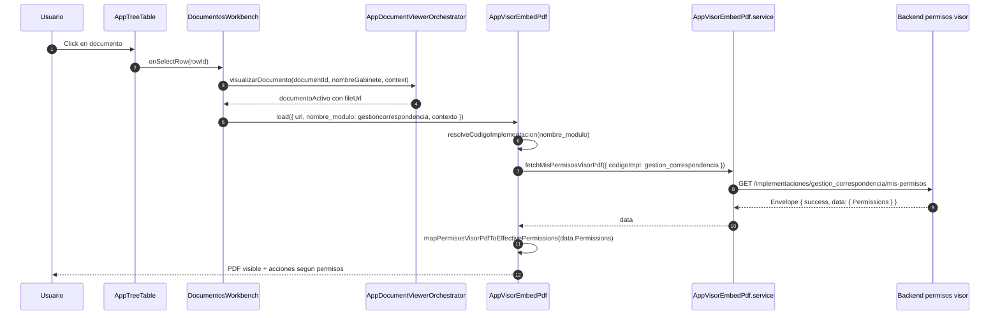
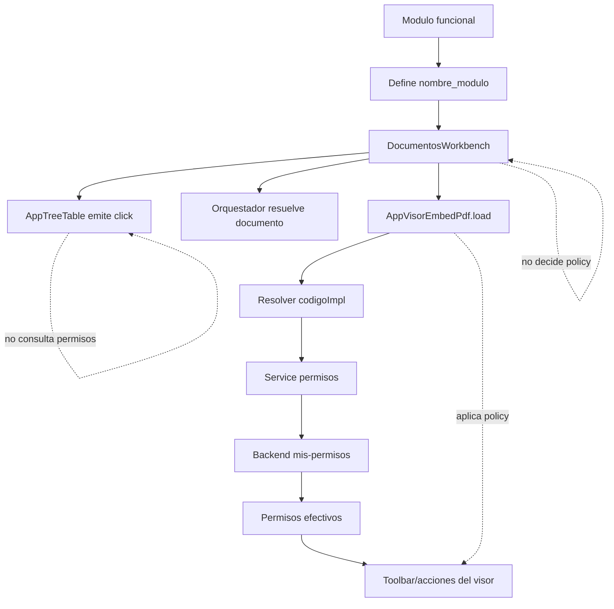

## Context

SCRUMCORE-236 corrige el desalineamiento entre el contrato real de permisos del visor PDF y la implementacion frontend actual.

El flujo actual ya tiene la separacion correcta de responsabilidades:

- `AppTreeTable` emite seleccion/accion de fila.
- `DocumentosWorkbench` orquesta el documento seleccionado y llama al visor.
- `AppVisorEmbedPdf` resuelve `codigoImpl`, consulta permisos y aplica policy.
- `clienteApi` agrega `Authorization: Bearer {jwt}`.
- Backend resuelve `IdUsuario` desde el claim `usuarioid`.

El problema no esta en el flujo de click, sino en el contrato del service y en el mapping de permisos.

## Goals

- Leer permisos desde `response.data.data.Permissions`.
- Modelar el envelope del backend sin perder metadata.
- Mapear codigos backend documentados a `ViewerEffectivePermissions`.
- Mantener `codigoImpl = gestion_correspondencia`.
- Mantener fail-closed para acciones sensibles.
- Mantener visualizacion del PDF si la URL es valida, sin bloquear por `pdf.view` en esta iteracion.
- Documentar arquitectura, contrato API, implementacion y pruebas.

## Non-Goals

- No crear administracion de permisos.
- No usar endpoints admin.
- No enviar `idUsuario` desde frontend.
- No introducir un nuevo sistema global de permisos.
- No cambiar contratos de `AppTreeTable`.
- No cambiar la responsabilidad de `DocumentosWorkbench`.
- No ampliar `ViewerEffectivePermissions` para `pdf.view`, `pdf.zoom` o `pdf.rotate` en esta iteracion.

## Decisions

### Decision 1: Service unwrap estricto del envelope

El service `fetchMisPermisosVisorPdf` SHALL consumir el envelope real y retornar `envelope.data`.

No se debe aceptar silenciosamente el contrato antiguo en raiz, salvo que se documente explicitamente como fallback temporal con pruebas. Para este ticket, el comportamiento recomendado es estricto.

### Decision 2: `codigoImpl` permanece derivado desde `nombre_modulo`

`DocumentosWorkbench` seguira enviando `nombre_modulo: "gestioncorrespondencia"`.

`resolveCodigoImplementacion("gestioncorrespondencia")` SHALL retornar `gestion_correspondencia`.

Esto mantiene el modulo desacoplado del codigo backend exacto y conserva la responsabilidad en el visor.

### Decision 3: `idUsuario` no viaja desde FE en `mis-permisos`

El endpoint normal es:

`GET /api/gestor-documental/permisos-visorpdf/implementaciones/{codigoImpl}/mis-permisos`

El usuario se resuelve por JWT. El frontend solo debe garantizar que `clienteApi` envie `Authorization: Bearer {jwt}`.

### Decision 4: Mapping alineado a codigos backend

El mapper SHALL usar:

- `pdf.print` -> `allowPrint`
- `pdf.download` -> `allowExport`
- `pdf.annotate.signature.place` -> `allowSignaturePlacement`
- `pdf.annotate.signature.delete` -> `allowSignatureDelete`
- `pdf.annotate.signature.lock` OR `pdf.annotate.signature.unlock` -> `allowSignatureLockToggle`
- permisos `pdf.annotate.*` de firma -> `allowAnnotationEdit`

### Decision 5: `pdf.view`, `pdf.zoom`, `pdf.rotate` quedan documentados

Estos codigos son parte del contrato backend, pero no se conectan a UI nueva en este ticket. No se amplia `ViewerEffectivePermissions` salvo cambio explicito de alcance.

## Target Flow

## Responsibility Map

## Risks / Trade-offs

- Riesgo: backend devuelve envelope valido pero `Permissions` vacio por perfil no configurado. Mitigacion: log debug y fail-closed.
- Riesgo: keys backend cambian de nombre. Mitigacion: tests de mapping por codigos documentados.
- Riesgo: ampliar `ViewerEffectivePermissions` aumente alcance visual. Mitigacion: documentar `pdf.view`, `pdf.zoom`, `pdf.rotate` sin conectar UI nueva.
- Riesgo: compatibilidad con ambientes antiguos. Mitigacion: no fallback silencioso; si se requiere, documentar y testear fallback temporal.

## Migration Plan

1. Ajustar tipos de contrato API.
2. Cambiar service para unwrap de `data`.
3. Actualizar mapping de permisos.
4. Mantener o ajustar log debug bajo `window.__DV_DEBUG__`.
5. Agregar tests de service y permissions mapping.
6. Generar documentacion enterprise.
7. Ejecutar validacion focalizada.

## Open Questions

- Confirmar si producto desea conectar `pdf.view=false` para bloquear visualizacion o mantener visualizacion por URL valida.
- Confirmar si `pdf.rotate` y `pdf.zoom` se conectaran a UI en un ticket posterior.
- Confirmar si se requiere fallback temporal para ambientes que aun devuelven `Permissions` en raiz.
