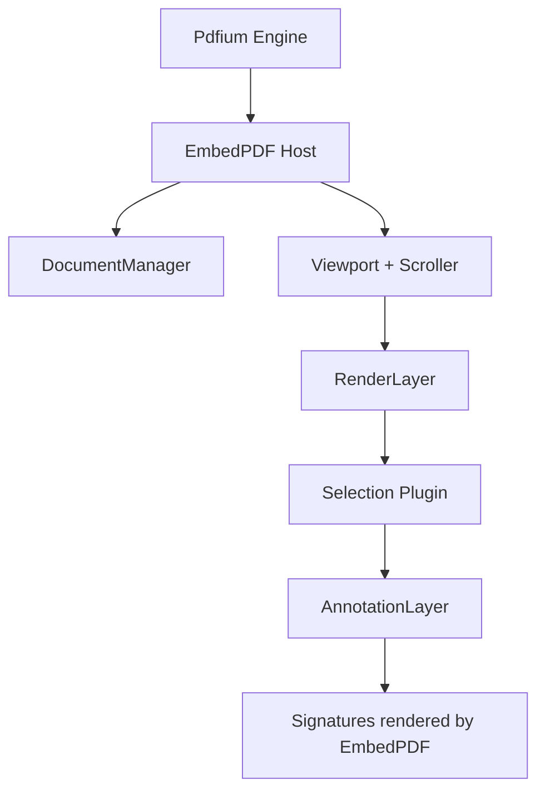
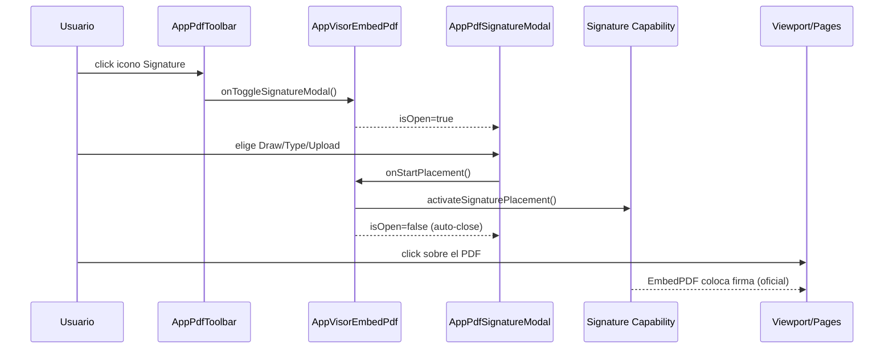

# SCRUMCORE-210 — Design (AppVisorEmbedPdf · Signature Plugin + Modal)

## Objetivo
Integrar el plugin oficial `@embedpdf/plugin-signature` en el componente enterprise `AppVisorEmbedPdf`, agregando un botón en el toolbar que abre un modal desacoplado para:
- Dibujar firma (oficial)
- Firma tipeada (oficial)
- Subir imagen (oficial)

Sin introducir lógica custom de PDF ni alterar la arquitectura del visor (zoom/rotate/thumbnails/print/export/pagination/password/docs).

## Principios / guardrails
- **0 lógica custom PDF**: prohibido `pdf-lib`, `fabric.js`, `konva`, canvas/drag/coords manuales.
- **Plugin-first**: toda lógica de firmas/annotations/render/placement/persistencia debe permanecer en EmbedPDF.
- **Encapsulación**: Workbench no conoce Signature/Annotation/plugins/engine/estados internos.
- **Compatibilidad**: no romper el pipeline actual (Scroller/Viewport/RenderLayer etc.).
- **Performance**: evitar recreación de plugins y handlers; no añadir `useMemo` innecesario.

## Componentes y responsabilidades
### `AppVisorEmbedPdf.tsx`
- Owner del estado `isSignatureModalOpen`.
- Registra los plugins Signature + dependencias (interaction/selection/history/annotation) mediante `createPluginRegistration(...)` en `plugins/pluginRegistration.ts`.
- Conecta:
  - Toolbar → `onOpenSignatureModal`
  - Modal → `onClose`
  - Signature capability → `activateSignaturePlacement()` (oficial)
- Integra `AnnotationLayer` en el pipeline de render **sin crear viewers paralelos** y **sin wrappers extra**.
- Gestiona persistencia temporal con `serializeEntries()` / `deserializeEntries()` a `localStorage`.

### `presentation/AppPdfToolbar.tsx`
- Solo presentacional.
- Añade botón/ícono `Signature` y dispara `onToggleSignatureModal()`.
- Mantiene memoización (si ya existe) para evitar rerenders por scroll.

### `presentation/AppPdfSignatureModal.tsx`
- Presentacional + UI orchestration mínima.
- Contiene únicamente:
  - `<SignatureDrawPad />`
  - `<SignatureTypePad />`
  - Sección upload usando `useSignatureUpload()` (oficial)
- Al “seleccionar” una firma:
  - Llama callback `onStartPlacement()` (provisto por `AppVisorEmbedPdf.tsx`) que ejecuta `activateSignaturePlacement()` (oficial)
  - Cierra modal automáticamente para permitir click en el PDF (flow requerido).

## Pipeline de render (actualizado)
Render del PDF debe conservar virtualización/lazy rendering.

## Flujo UI (toolbar → modal → placement)

## Persistencia (temporal)
- Serializar entradas de annotations/signatures con helpers oficiales:
  - `serializeEntries()` → `localStorage`
  - `deserializeEntries()` desde `localStorage` al abrir documento
- **No backend** en esta fase.
- Key recomendada (interna, encapsulada): `appvisor:embedpdf:annotations:<documentId>`

## Accesibilidad
- Toolbar: `aria-label` en el botón Signature.
- Modal:
  - `role="dialog"` + `aria-modal="true"`
  - Focus trap / foco inicial en el modal
  - Escape para cerrar
- Inputs de upload: `aria-label` claro.

## CSS / Visual
- Solo **CSS Modules**.
- Modal enterprise minimalista y responsive.
- Sin wrappers extra alrededor del visor.

## Criterios de “done” de diseño
- El modal es 100% desacoplado del engine/plugins (no recibe `documentId`, engine, ni objetos EmbedPDF).
- La activación de placement ocurre en `AppVisorEmbedPdf.tsx` (encapsulado).
- El render de firmas ocurre por `AnnotationLayer` (oficial) dentro del pipeline existente.
