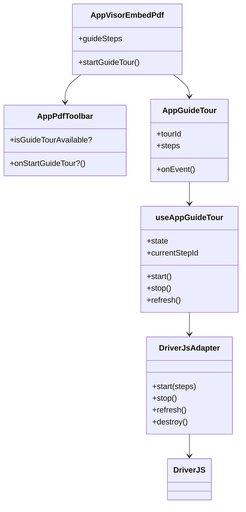
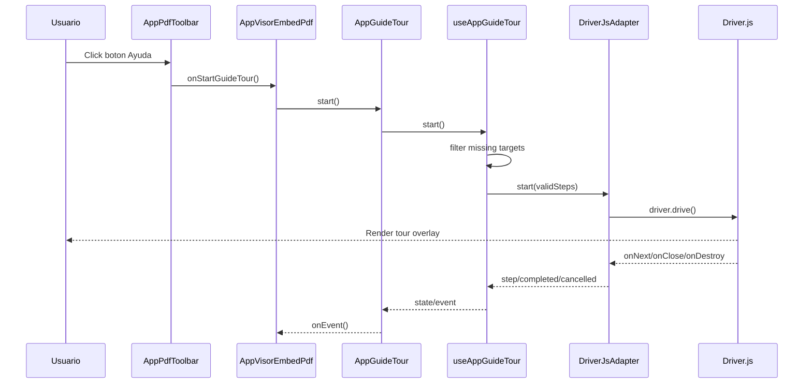
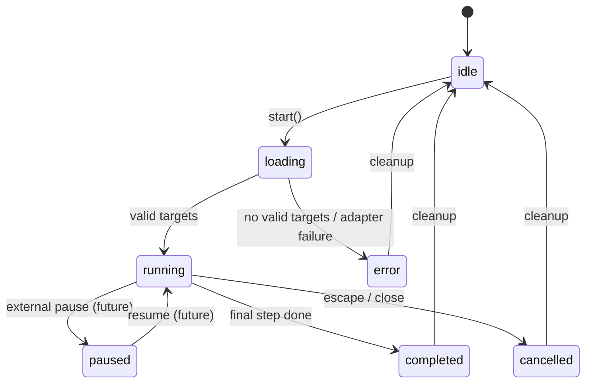

# SCRUMCORE-235 - Design

## Context

SCRUMCORE-235 crea `AppGuideTour`, un componente reusable enterprise basado en Driver.js para guias interactivas. La primera integracion real sera `AppVisorEmbedPdf`, agregando un boton de ayuda en la toolbar para iniciar un recorrido guiado de las herramientas visibles del visor PDF.

El cambio debe ser una capa de presentacion desacoplada. No debe mover logica PDF, no debe introducir Driver.js dentro de plugins existentes y no debe cambiar el comportamiento funcional de zoom, rotacion, print, export, firma, anotaciones, thumbnails ni scroll.

## Goals

- Crear `AppGuideTour` reusable para el Design System.
- Encapsular Driver.js detras de `DriverJsAdapter`.
- Exponer un hook `useAppGuideTour` con API estable.
- Integrar una guia inicial en `AppVisorEmbedPdf`.
- Agregar un boton de ayuda accesible en `AppPdfToolbar`.
- Definir steps por configuracion, no por logica interna del visor.
- Registrar eventos no sensibles del tour.
- Cubrir unit, integration y Playwright segun alcance del ticket.
- Crear documentacion enterprise en `docs/Components/AppGuideTour/GuiaVisorPDF/`.

## Non-Goals

- No modificar reglas funcionales del visor PDF.
- No alterar permisos, firmas, anotaciones, export, print o navegacion.
- No mover estado documental al tour.
- No registrar URLs, tokens, nombres de documentos o contenido PDF.
- No acoplar consumidores a Driver.js.
- No crear dependencia circular entre `AppGuideTour` y `AppVisorEmbedPdf`.

## Decisions

### D1 - Componente reusable, integracion por configuracion

`AppGuideTour` vive en `src/app/Components/UI/AppGuideTour/` y no conoce `AppVisorEmbedPdf`. El visor solo le pasa `tourId`, `steps` y opcionalmente callbacks de observabilidad.

### D2 - Driver.js encapsulado

Driver.js se importa solo dentro de `drivers/DriverJsAdapter.ts`. Consumidores y hooks trabajan contra una interfaz interna (`AppGuideTourDriver`) para permitir reemplazo futuro.

### D3 - Targets estables via atributos data

Los pasos del tour apuntan a selectores estables como `[data-guide-tour-id="pdf-zoom-in"]`, no a clases CSS generadas ni texto visual. La integracion en `AppPdfToolbar` agrega estos atributos sin cambiar layout ni comportamiento.

### D4 - Boton de ayuda como accion de toolbar

`AppPdfToolbar` recibe una nueva accion opcional de ayuda:

- `onStartGuideTour?: () => void`
- `isGuideTourAvailable?: boolean`

Si no se pasan, el toolbar se comporta como hoy. Esto conserva compatibilidad para consumers actuales y tests existentes.

### D5 - Estado interno minimo

El estado del tour se limita a:

- `idle`
- `loading`
- `running`
- `paused`
- `completed`
- `cancelled`
- `error`

El estado no gobierna PDF ni toolbar; solo describe el ciclo visual de la guia.

### D6 - Observabilidad sin datos sensibles

Eventos permitidos:

- `guide_started`
- `guide_completed`
- `guide_cancelled`
- `guide_step_changed`
- `guide_error`

Payload permitido:

- `tourId`
- `stepId`
- `stepIndex`
- `totalSteps`
- `reason` tecnico no sensible

Payload prohibido:

- URL del documento
- token
- nombre de archivo
- contenido PDF
- identificadores documentales sensibles

### D7 - Driver instance lazy y estable

El adapter crea instancia de Driver.js solo cuando se inicia el tour o cuando el hook la necesita por primera vez. La instancia se reutiliza mientras el componente vive y se destruye en cleanup.

## Proposed File Structure

```text
src/app/Components/UI/AppGuideTour/
  AppGuideTour.tsx
  AppGuideTour.types.ts
  AppGuideTour.service.ts
  AppGuideTour.adapter.ts
  AppGuideTour.constants.ts
  index.ts
  drivers/
    DriverJsAdapter.ts
  hooks/
    useAppGuideTour.ts
  providers/
    AppGuideTourProvider.tsx
  tests/
    AppGuideTour.test.tsx
    DriverJsAdapter.test.ts
    useAppGuideTour.test.tsx
```

Integration files:

```text
src/app/Components/UI/AppVisorEmbedPdf/AppVisorEmbedPdf.tsx
src/app/Components/UI/AppVisorEmbedPdf/presentation/AppPdfToolbar.tsx
src/app/Components/UI/AppVisorEmbedPdf/presentation/AppPdfToolbar.module.css
src/app/Components/UI/AppVisorEmbedPdf/AppVisorEmbedPdf.test.tsx
```

Documentation:

```text
docs/Components/AppGuideTour/GuiaVisorPDF/
  SCRUMCORE-235-Arquitectura.md
  SCRUMCORE-235-Implementacion-Detallada.md
  SCRUMCORE-235-Pruebas.md
  SCRUMCORE-235-Metadata.md
```

## Public Contracts

```ts
export type AppGuideTourSide = "top" | "bottom" | "left" | "right";

export type AppGuideTourState =
  | "idle"
  | "loading"
  | "running"
  | "paused"
  | "completed"
  | "cancelled"
  | "error";

export type AppGuideTourStep = {
  id: string;
  element: string;
  title: string;
  description: string;
  side?: AppGuideTourSide;
};

export type AppGuideTourEventName =
  | "guide_started"
  | "guide_completed"
  | "guide_cancelled"
  | "guide_step_changed"
  | "guide_error";

export type AppGuideTourEvent = {
  name: AppGuideTourEventName;
  tourId: string;
  stepId?: string;
  stepIndex?: number;
  totalSteps?: number;
  reason?: string;
};

export type AppGuideTourProps = {
  tourId: string;
  steps: AppGuideTourStep[];
  autoStart?: boolean;
  onEvent?: (event: AppGuideTourEvent) => void;
};
```

Hook contract:

```ts
export type UseAppGuideTourResult = {
  state: AppGuideTourState;
  currentStepId: string | null;
  isRunning: boolean;
  start: () => void;
  stop: () => void;
  refresh: () => void;
};
```

Driver adapter contract:

```ts
export type AppGuideTourDriver = {
  start: (steps: AppGuideTourStep[]) => void;
  stop: () => void;
  refresh: () => void;
  destroy: () => void;
};
```

## AppVisorEmbedPdf Tour Steps

Initial required targets:

| Step id | Selector | Purpose |
| --- | --- | --- |
| `pdf-toolbar` | `[data-guide-tour-id="pdf-toolbar"]` | Presentar toolbar principal. |
| `pdf-thumbnails` | `[data-guide-tour-id="pdf-thumbnails-toggle"]` | Abrir/cerrar miniaturas. |
| `pdf-zoom-out` | `[data-guide-tour-id="pdf-zoom-out"]` | Reducir zoom. |
| `pdf-zoom-level` | `[data-guide-tour-id="pdf-zoom-level"]` | Leer escala actual. |
| `pdf-zoom-in` | `[data-guide-tour-id="pdf-zoom-in"]` | Aumentar zoom. |
| `pdf-reset-zoom` | `[data-guide-tour-id="pdf-reset-zoom"]` | Volver a 100%. |
| `pdf-rotate-left` | `[data-guide-tour-id="pdf-rotate-left"]` | Rotar izquierda. |
| `pdf-rotate-right` | `[data-guide-tour-id="pdf-rotate-right"]` | Rotar derecha. |
| `pdf-signature` | `[data-guide-tour-id="pdf-signature"]` | Abrir firma. |
| `pdf-lock-signature` | `[data-guide-tour-id="pdf-lock-signature"]` | Bloquear/desbloquear firma. |
| `pdf-delete-signature` | `[data-guide-tour-id="pdf-delete-signature"]` | Eliminar firma seleccionada. |
| `pdf-print` | `[data-guide-tour-id="pdf-print"]` | Imprimir. |
| `pdf-export` | `[data-guide-tour-id="pdf-export"]` | Exportar/descargar. |
| `pdf-help` | `[data-guide-tour-id="pdf-help"]` | Reiniciar ayuda. |
| `pdf-pagination` | `[data-guide-tour-id="pdf-pagination"]` | Navegacion de paginas. |
| `pdf-scroll-top` | `[data-guide-tour-id="pdf-scroll-top"]` | Volver arriba cuando aplique. |

Steps for unavailable features may be omitted at runtime if their element is not present. The adapter/service must filter missing targets before starting.

## Integration Strategy

1. Add dependency `driver.js`.
2. Create `AppGuideTour` module.
3. Add stable `data-guide-tour-id` attributes to PDF toolbar and visible overlays.
4. Add optional help button to `AppPdfToolbar`.
5. Create `APP_VISOR_EMBED_PDF_GUIDE_STEPS` in a local constants/config file.
6. Instantiate `useAppGuideTour` in `AppVisorEmbedPdf`.
7. Pass `onStartGuideTour` to `AppPdfToolbar`.
8. Render `AppGuideTour` with the PDF guide steps.

## Accessibility

- Help button must be reachable by keyboard.
- Help button must have `aria-label="Guia interactiva"`.
- Tooltip/title must include "Ayuda" or "Guia interactiva".
- Escape closes the tour.
- Focus must remain visible.
- The tour must not trap focus permanently after completion/cancel.
- Disabled toolbar controls may be included only if Driver.js can target them without forcing interaction.

## Performance

- Steps must be memoized.
- Driver instance must not be recreated on every render.
- Starting/stopping the tour must not trigger PDF reloads.
- No tour state may be stored in PDF plugin state.
- Missing targets are filtered at start time to avoid repeated DOM queries during render.

## Risks and Mitigations

| Risk | Mitigation |
| --- | --- |
| Driver.js CSS affects global UI. | Import Driver.js CSS once in `AppGuideTour` module or scoped entry, then add minimal local overrides if needed. |
| Toolbar layout shifts with help button. | Reuse existing `AppPdfToolbar.module.css` button class and place help near end after export or before spacer by design decision. |
| Missing target causes tour error. | Filter steps with missing DOM elements before calling adapter. Emit `guide_error` only if no valid steps remain. |
| Disabled buttons confuse users. | Step description must explain disabled policy where relevant; no click is triggered by the tour. |
| Tests become flaky due Driver.js DOM behavior. | Mock Driver.js in unit/integration tests; reserve real DOM flow for Playwright. |

## Mermaid Diagrams

### classDiagram



### sequenceDiagram



### stateDiagram-v2



## Open Questions Resolved for Implementation

- The component name is `AppGuideTour`, not `AppAppguidetour`.
- The primary integration target is `AppVisorEmbedPdf`.
- Search is listed in Jira, but current `AppPdfToolbar` does not expose search. It must not be invented in this ticket; only visible/implemented controls are included.
- Fit Width / Fit Page are mentioned in Jira, but current toolbar exposes Auto-Fit behavior and reset zoom, not explicit fit buttons. Do not add new fit buttons as part of the tour.
